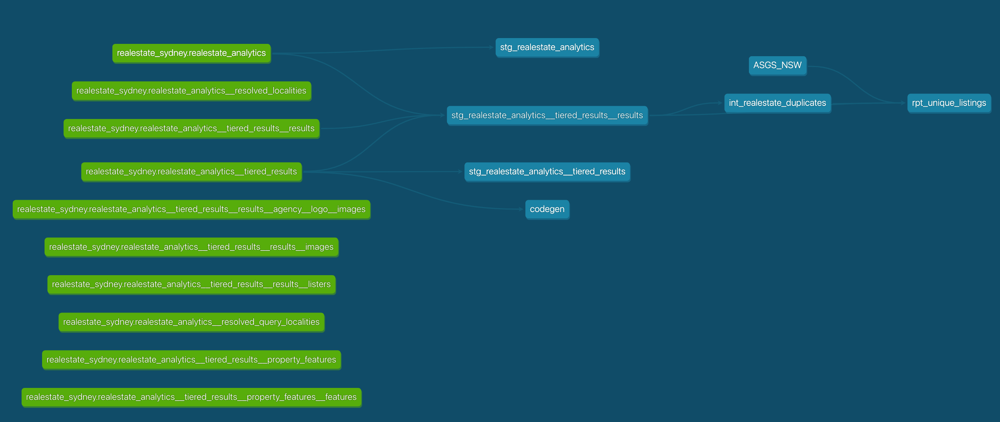
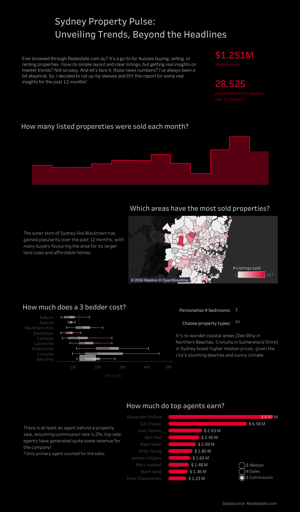

# Sydney House Price

    

This project explores the Sydney Real Estate dataset collected from (https://www.realestate.com.au), covering 12 months data from April 2023 to April 2024

dbt core is used for data transformation, cleaning data, removing duplicates. BigQuery serve as data warehouse and Tableau for data visualization.

## Project Motivation

Realestate.com.au is the top choice for Aussies in property transactions, but getting true market insights is a challenge. As a skeptical analyst, I've taken on the task of delving into real estate data to uncover real insights, which might be helpful with thousands of Sydney potential property buyers.

## Tech Stack and Tools

- Database: **BigQuery**
- Data Transformation: **dbt**
- Data Visualization: **Tableau (Public)**
- CICD: **Git**

## Setup Instructions

1. **Environment Setup**: Clone the repository and install the required dependencies: 'pip install -r requirements.txt'
2. **Database Configuration**: Set up Google Cloud Storage, Google Cloud CLI and BigQuery
3. **Database Connection**: Export to Gsheets, setup regular refresh option for most up-to-date data
4. **Data Visualization**: Bigquery is not a native connection for Tableau Public, instead we are using Google Drive connector

## dbt Structure

Dig into how we structure the files, folders, and models for our three primary layers in the models directory, which build on each other:

- Staging — creating our atoms, our initial modular building blocks, from source data
- Intermediate — stacking layers of logic with clear and specific purposes to prepare our staging models to join into the entities we want
- Reporting — bringing together our modular pieces into a wide, rich vision of the entities for the final tableau report

    

## Tableau report

The series of transformations run helps identify potential duplicate listings among other things. Duplicates are produced by

1. the same listings returned from different API call as listings from surrounding suburbs(one unique).
2. the property listing was replaced by a new one due to unresolved issue with previous buyer(both unique).
   An intermediate model, int_realestate_duplicates.sql, employs logic to pinpoint unique listings. It assumes that properties with the same address and sold dates within a 7-day window are duplicates.
   De-duplicating these listings allows for the core analysis to take place being the able to analyse accurately:

- How many listed properties sold last 12 months?
- Which areas have the most sold properties?
- How much does a 3 bedder cost?
- How much do top agents earn?

Link to the tableau dashboard (https://public.tableau.com/app/profile/bellajiang/viz/SydneyPropertyPulse_UnveilingTrendsBeyondtheHeadlines/RealEstate)

    

